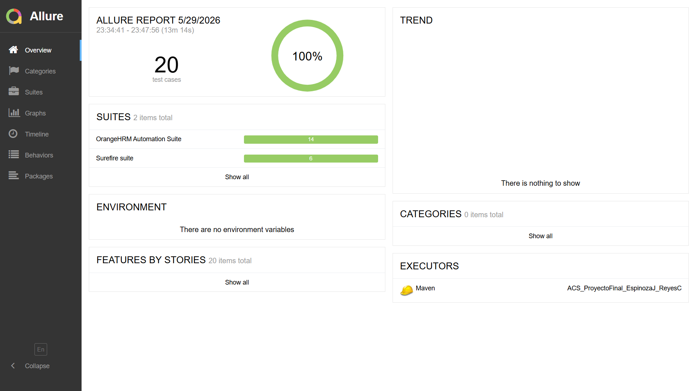
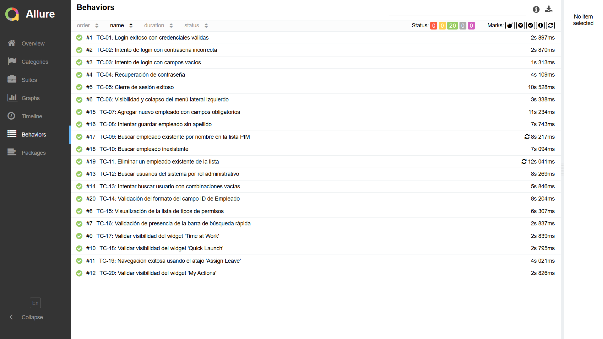
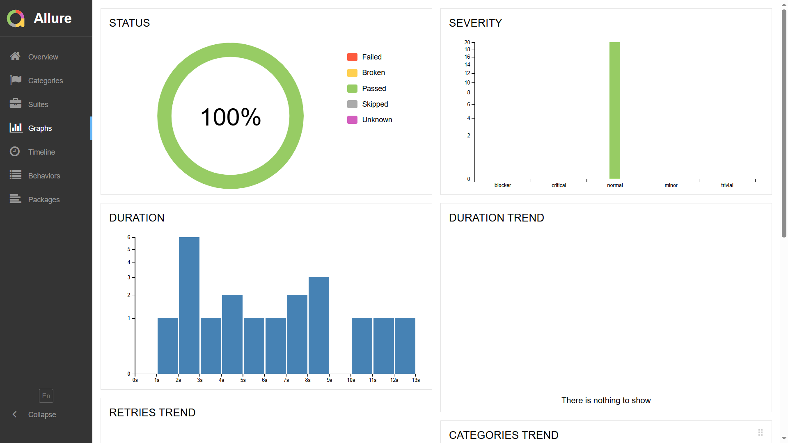
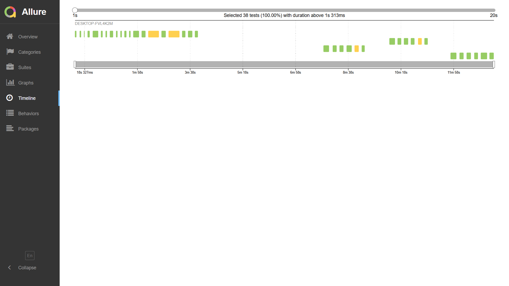

# Evidencias de Ejecución

## Cómo generar y abrir el reporte
1. Ejecuta las pruebas: `mvn test`
2. Genera el reporte: `mvn allure:report`
3. Abre el reporte: `mvn allure:serve`

## Resultados validados
- Login funcional
- Módulo PIM
- Módulo Admin
- Reporte de ejecución con Allure

## Capturas de evidencia
### Overview

### Behaviors

### Graphs

### Timeline

## Nota
Estas imágenes muestran el resultado de la ejecución realizada como evidencia del proyecto.
